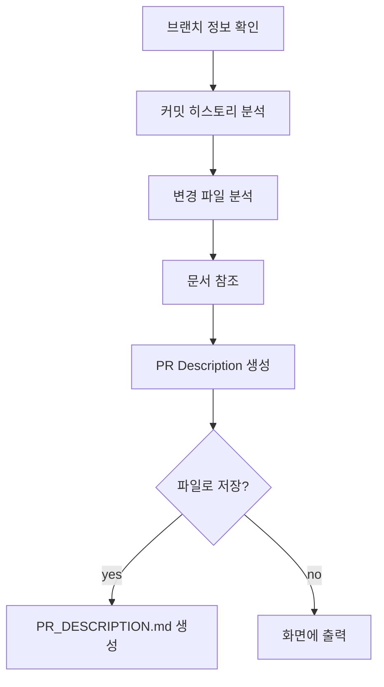

# PR Description Skill

커밋 히스토리, 변경된 파일, 문서를 분석하여 PR description을 자동 생성합니다.

## When to Use

- `/pr-description` 명령 시
- "PR 설명", "PR 코멘트", "PR 리뷰" 키워드 시
- spec-update 완료 후

## Process



## Step 1: 브랜치 정보 확인

```bash
# 현재 브랜치
git branch --show-current

# 이슈 번호 추출
# feature/UNICORN-66265-sdd → UNICORN-66265
```

## Step 2: 커밋 히스토리 분석

```bash
# 브랜치의 커밋 목록
git log origin/main..HEAD --oneline

# 또는 최근 N개 커밋
git log -10 --oneline
```

### 커밋 분류

| 타입 | 설명 |
|------|------|
| 신규 기능 | add, implement, create |
| 리팩토링 | refactor, rename, move |
| 버그 수정 | fix, resolve, handle |
| 문서 | docs, add module spec, ADR |

## Step 3: 변경 파일 분석

```bash
# 변경된 파일 통계
git diff origin/main..HEAD --stat

# 파일 목록
git diff origin/main..HEAD --name-only
```

### 파일 구조 파악

- `src/main/` → 소스 코드
- `src/test/` → 테스트 코드
- `docs/` → 문서
- `build.gradle` → 빌드 설정

## Step 4: 문서 참조

체크포인트 또는 최종 문서에서 정보 추출:

```
docs/modules/{module}/README.md
- Overview
- API / Interface
- Usage Examples

docs/decisions/{num}-*.md
- Decision
- Reason
```

## Step 5: PR Description 생성

### 템플릿

```markdown
## PR: {이슈번호} - {제목}

### 📋 Summary

{1-2문장 요약}

---

### ✨ 주요 변경사항

#### 1. {변경사항 1}

```{언어}
{코드 예시}
```

#### 2. {변경사항 2}

| 항목 | 내용 |
|------|------|
| ... | ... |

---

### 🏗️ 설계 결정

| 결정 | 선택 | 이유 |
|------|------|------|
| ... | ... | ... |

---

### 📁 파일 구조

```
{디렉토리 구조}
```

---

### ✅ 테스트 커버리지

- {테스트 항목 1} ✓
- {테스트 항목 2} ✓

---

### 📚 문서

- {문서 1}
- {문서 2}

---

### 🔧 사용법

```{언어}
{사용 예시}
```

---

### 🚀 향후 확장

{확장 가이드}
```

## Step 6: 출력

### 옵션 제시

```markdown
**PR Description 생성 완료**

| Option | Action |
|--------|--------|
| file | PR_DESCRIPTION.md 파일로 저장 |
| show | 마크다운으로 화면에 출력 |
| copy | 클립보드에 복사 (지원 시) |

Reply: file, show, or copy
```

## Output

- `PR_DESCRIPTION.md` 파일 생성 (선택 시)
- 화면에 마크다운 출력

## 자동 분석 항목

### 커밋 메시지에서 추출

- 이슈 번호
- 변경 유형 (add, fix, refactor, docs)
- 주요 키워드

### 코드에서 추출

- 인터페이스/클래스 정의
- 주요 메서드 시그니처
- Enum 상수 목록

### 테스트에서 추출

- 테스트 메서드 이름 (`@DisplayName` 우선)
- 테스트 케이스 수

## Examples

### Example 1: 새 모듈 추가

```
브랜치: feature/UNICORN-66265-sdd
커밋: 6개
파일: 7개 생성

→ PR Description:
- Summary: OAuth scope 모듈 신규 구현
- 주요 변경: Scope 인터페이스, enum 구현체
- 설계 결정: Enum 기반, Set<Scope> 포함
- 테스트: 10개 테스트 케이스
```

### Example 2: 기존 기능 수정

```
브랜치: fix/BUG-123-null-handling
커밋: 2개
파일: 3개 수정

→ PR Description:
- Summary: null 입력 시 NPE 수정
- 주요 변경: null 체크 추가
- 테스트: null 케이스 테스트 추가
```

## Error Handling

- 커밋 없음 → "변경사항이 없습니다" 메시지
- 이슈 번호 없음 → 브랜치 이름 사용
- 문서 없음 → 코드에서만 분석

## Integration

```
/spec-update (완료)
    ↓
/pr-description (현재)
    ├── git log 분석
    ├── git diff 분석
    ├── 문서 참조
    └── PR Description 생성
    ↓
[PR 생성 준비 완료]
```
