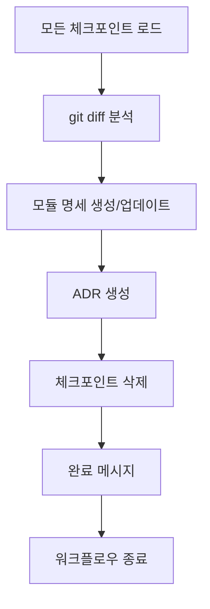

## When to Use

- verify 성공 후 자동 전환 시
- "명세 동기화", "문서화", "정리" 키워드 시

## Prerequisites

- verify 통과 (status: PASS)
- 모든 체크포인트 존재:
  - `docs/.checkpoints/{feature}/specify.md`
  - `docs/.checkpoints/{feature}/plan.md`
  - `docs/.checkpoints/{feature}/task.md`

## Process



## Step 1: Load All Checkpoints

모든 체크포인트와 git diff를 분석합니다.

```
docs/.checkpoints/{feature}/specify.md
- Feature Overview
- Functional Requirements
- Acceptance Criteria
- Clarifications

docs/.checkpoints/{feature}/plan.md
- Architecture Overview
- Technology Stack
- Data Model
- Technical Decisions
- Clarifications

docs/.checkpoints/{feature}/task.md
- Task List
- Task Details
- Clarifications
```

### Git Diff 분석

```bash
git diff --stat HEAD~{N}...HEAD
```

변경된 파일 목록과 범위를 파악합니다.

## Step 2: Generate Module Spec

- `docs/modules/{module}/README.md`를 생성합니다.
- 이미 있는 경우, 업데이트합ㄴ디ㅏ.

### 모듈 경로 결정

체크포인트의 내용과 실제 코드 구조를 기반으로 모듈 경로를 결정합니다.

```markdown
**모듈 경로 확인**

**Suggested:** docs/modules/auth/README.md - 인증 관련 기능

Reply "yes" to accept, or provide a different path.
```

### 모듈 명세 내용

```markdown
# Auth Module

## Overview
사용자 인증을 담당하는 모듈입니다. JWT 기반 토큰 인증을 제공합니다.

## Responsibilities
- 사용자 로그인/로그아웃
- JWT 토큰 발급 및 검증
- 세션 관리

## API / Interface

### Public Functions

```java
public boolean contains(Object o);
```

### Events / Hooks
- `onLogin`: 로그인 성공 시 발생
- `onLogout`: 로그아웃 시 발생

## Data Model

```java
class User {
  private final String id;
  public String getId() {
    return this.id;
  }
}
```

## Dependencies
- bcrypt: 비밀번호 해싱
- jsonwebtoken: JWT 처리
- PostgreSQL: 사용자 데이터 저장

## Usage Examples

```java
final User user = new User("1");
```

## Error Handling
- `InvalidCredentialsException`: 잘못된 이메일/비밀번호

## Related Decisions
- [ADR-001: JWT 기반 인증 선택](../decisions/001-auth-jwt.md)
```

## Step 3: Generate ADR

`docs/decisions/{num}-{title}.md`를 생성합니다.

### ADR 번호 결정

기존 ADR 파일을 확인하여 다음 번호를 할당합니다.

```bash
ls docs/decisions/
# 001-initial-architecture.md
# 002-database-choice.md
# → 다음: 003
```

### ADR 내용

체크포인트의 Technical Decisions와 Clarifications를 통합합니다.

```markdown
# ADR-003: JWT 기반 인증

## Status
Accepted

## Date
2026-01-29

## Context
사용자 인증 시스템 구현이 필요합니다. 확장 가능하고 stateless한 인증 방식이 필요합니다.

## Decision Drivers
- 수평 확장 필요
- 마이크로서비스 아키텍처 고려
- 모바일 앱 지원 필요

## Considered Options

### Option A: JWT + Refresh Token
- **Pros**: Stateless, 확장 용이, 표준화
- **Cons**: 토큰 무효화 어려움

### Option B: Session-based
- **Pros**: 서버에서 완전 제어
- **Cons**: 상태 관리 필요, 확장 어려움

### Option C: OAuth only
- **Pros**: 보안 강력
- **Cons**: 설정 복잡, 외부 의존성

## Decision
**Selected**: Option A - JWT + Refresh Token

**Reason**: Stateless 특성으로 수평 확장이 용이하고, 마이크로서비스 환경에 적합합니다.

## Consequences

### Positive
- 서버 상태 관리 불필요
- 수평 확장 용이
- 표준 라이브러리 활용 가능

### Negative
- 토큰 즉시 무효화 불가 (블랙리스트 필요)
- 토큰 크기로 인한 네트워크 오버헤드

### Risks
- 토큰 탈취 시 만료까지 사용 가능
- 적절한 토큰 수명 설정 필요

## Clarifications
### Session 2026-01-29
- Q: 인증 방식은? → A: JWT + refresh token
- Q: 세션 만료 시간? → A: Access 15분, Refresh 7일
- Q: 토큰 저장 위치? → A: httpOnly cookie

## Related
- Module: [auth](../modules/auth/README.md)
```

## Step 4: Delete Checkpoints

체크포인트 파일들을 삭제합니다.

```markdown
**체크포인트 삭제 확인**

다음 파일들이 삭제됩니다:
- docs/.checkpoints/auth-login/specify.md
- docs/.checkpoints/auth-login/plan.md
- docs/.checkpoints/auth-login/task.md

모든 내용이 최종 문서에 통합되었습니다.

Reply "yes" to delete, or "no" to keep.
```

삭제 후:

```bash
rm docs/.checkpoints/{feature}/*.md

# .checkpoints 폴더가 비면 폴더도 삭제
rmdir docs/.checkpoints 2>/dev/null || true
```

## Step 5: Completion Message

```markdown
## Spec-Update 완료

**Feature**: auth-login

### 생성된 문서

#### Module Spec
- `docs/modules/auth/README.md`
  - Overview, API, Data Model, Examples

#### ADR
- `docs/decisions/003-auth-jwt.md`
  - JWT 기반 인증 선택 결정

### 삭제된 체크포인트
- ✓ docs/.checkpoints/auth-login/specify.md
- ✓ docs/.checkpoints/auth-login/plan.md
- ✓ docs/.checkpoints/auth-login/task.md

### Summary
- Module specs: 1 created
- ADRs: 1 created
- Checkpoints: 3 deleted

---

## 🎉 워크플로우 완료

**Feature**: auth-login
**Duration**: specify → plan → task → implement → verify → spec-update
**Commits**: 9
**Files changed**: 18

### learning 

이번 세션에서 에이전트가 배워야하는 것이 있는 경우, learn 커맨드를 실행합니다.

| Option | Action |
|--------|--------|
| yes | /learn 실행 |
| no | 종료 |

Reply: yes, no, or a new feature request
```

## Output

- 생성: `docs/modules/{module}/README.md`
- 생성: `docs/decisions/{num}-{title}.md`
- 삭제: `docs/.checkpoints/{feature}/*.md`
- 워크플로우 종료

## Error Handling

- 체크포인트 없음 → 이전 단계 필요 안내
- 모듈 경로 충돌 → 새 경로 또는 병합 옵션
- ADR 번호 충돌 → 다음 번호 자동 할당
- 삭제 실패 → 수동 삭제 안내

## Multiple Features

여러 기능이 동시에 진행된 경우:

```markdown
**여러 기능의 체크포인트가 있습니다.**

| Feature | Checkpoints | Status |
|---------|-------------|--------|
| auth-login | 3 | Ready |
| user-profile | 3 | Ready |

어떤 기능을 정리할까요?
- A: auth-login만
- B: user-profile만
- C: 모두
```

## Integration

```
/verify (성공)
    ↓
/spec-update (현재)
    ├── 체크포인트 통합
    ├── 모듈 명세 생성
    ├── ADR 생성
    └── 체크포인트 삭제
    ↓
[워크플로우 완료]
    ↓
사용자 응답? → /learn 실행
```
