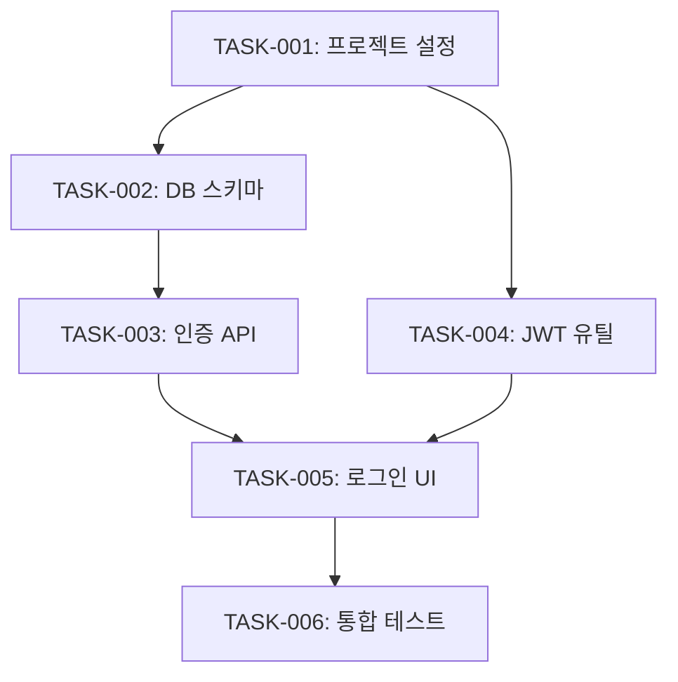

# Task Skill

설계를 바탕으로 구현 태스크를 분리하고 순서를 정합니다.

## When to Use

- `/task` 명령 시
- plan 완료 후 자동 전환 시
- "태스크", "작업 분리", "TODO" 키워드 시

## Prerequisites

- `docs/.checkpoints/{feature}-specify.md` 존재 (status: ready)
- `docs/.checkpoints/{feature}-plan.md` 존재 (status: ready)
- 없으면 이전 단계 먼저 실행 안내

## Process

```mermaid
flowchart TD
    A[Specify/Plan 체크포인트 로드] --> B[Task 체크포인트 생성]
    B --> C[태스크 초안 작성]
    C --> D[Clarify 호출]
    D --> E{모호함 해소?}
    E -->|No| D
    E -->|Yes| F[태스크 확정]
    F --> G[체크포인트 Ready]
    G --> H[완료 메시지]
    H --> I{다음 단계?}
    I -->|yes| J[/implement 실행]
    I -->|no| K[대기]
```

## Step 1: Load Previous Checkpoints

```
docs/.checkpoints/{feature}-specify.md
- Functional Requirements
- Acceptance Criteria

docs/.checkpoints/{feature}-plan.md
- Architecture Overview
- Component Design
- File Structure
- Technical Decisions
```

## Step 2: Create Task Checkpoint

`docs/.checkpoints/{feature}-task.md` 생성

```markdown
# auth-login - Task Checkpoint

## Metadata
- feature: auth-login
- stage: task
- status: in_progress
- created: 2026-01-29
- depends_on: 
  - docs/.checkpoints/auth-login-specify.md
  - docs/.checkpoints/auth-login-plan.md
```

## Step 3: Draft Task List

specify의 Functional Requirements와 plan의 Component Design을 기반으로 태스크 초안을 작성합니다.

### Task ID 규칙
- `TASK-{NNN}`: 순차 번호
- 예: TASK-001, TASK-002, ...

### 태스크 분해 기준
1. **단일 책임**: 각 태스크는 하나의 목적
2. **테스트 가능**: 완료 기준 명확
3. **의존성 최소화**: 독립적 작업 가능
4. **적정 크기**: 1-4시간 분량

```markdown
## Content

### Task List
| Task ID | Description | Dependencies | Effort |
|---------|-------------|--------------|--------|
| TASK-001 | 프로젝트 초기 설정 | - | S |
| TASK-002 | User 엔티티 및 DB 스키마 | TASK-001 | M |
| TASK-003 | 인증 API 엔드포인트 | TASK-002 | M |
| TASK-004 | JWT 토큰 유틸리티 | TASK-001 | S |
| TASK-005 | 로그인 컴포넌트 | TASK-003, TASK-004 | M |
| TASK-006 | 통합 테스트 | TASK-005 | M |
```

Effort: S(Small, <1h), M(Medium, 1-4h), L(Large, >4h)

## Step 4: Run Clarify

clarify skill을 호출하여 태스크 관련 모호함을 해소합니다.

**Clarify 포커스 카테고리** (task 단계):
- Interaction & UX
- Non-Functional
- Integration
- Edge Cases (필수)
- Completion Signals (필수)
- Misc

### 예상 질문들

```markdown
**테스트 전략**
**Recommended:** Option B - 균형잡힌 커버리지

| Option | Description |
|--------|-------------|
| A | Unit tests only |
| B | Unit + Integration tests |
| C | Unit + Integration + E2E |

---

**태스크 우선순위**
**Suggested:** 백엔드 → 프론트엔드 순서 - API가 먼저 있어야 UI 테스트 가능

Reply "yes" to accept, or provide different order.
```

## Step 5: Finalize Tasks

clarify 완료 후 태스크를 확정합니다.

### Implementation Order

```markdown
### Implementation Order


```

### Task Details

```markdown
### Task Details

#### TASK-001: 프로젝트 초기 설정
- **Description**: 프로젝트 구조 생성, 의존성 설치
- **Files**:
  - package.json
  - tsconfig.json
  - src/index.ts
- **Acceptance**:
  - [ ] npm install 성공
  - [ ] TypeScript 컴파일 성공
- **Test**: 빌드 성공 확인

#### TASK-002: User 엔티티 및 DB 스키마
- **Description**: User 모델 정의, 마이그레이션
- **Files**:
  - src/models/User.ts
  - migrations/001_create_users.sql
- **Acceptance**:
  - [ ] User 테이블 생성
  - [ ] CRUD 동작 확인
- **Test**: 단위 테스트

...
```

## Step 6: Completion Message

```markdown
## Task 완료

**체크포인트**: `docs/.checkpoints/auth-login-task.md`
**상태**: Ready

### Task Summary
| Task ID | Description | Effort |
|---------|-------------|--------|
| TASK-001 | 프로젝트 초기 설정 | S |
| TASK-002 | User 엔티티 및 DB 스키마 | M |
| TASK-003 | 인증 API 엔드포인트 | M |
| TASK-004 | JWT 토큰 유틸리티 | S |
| TASK-005 | 로그인 컴포넌트 | M |
| TASK-006 | 통합 테스트 | M |

**Total**: 6 tasks, Est. 8-12 hours

---

**다음 단계**: /implement - 구현 시작

| Option | Action |
|--------|--------|
| yes | /implement 바로 실행 |
| no | 대기 (나중에 수동 실행) |

Reply: yes, no, or another command
```

## Step 7: Next Stage Transition

사용자 응답에 따라:
- `yes` → /implement skill 자동 실행
- `no` → 대기
- 다른 명령 → 해당 명령 실행

## Output

- 생성: `docs/.checkpoints/{feature}-task.md`
- 상태: Ready
- 다음 단계: /implement 추천

## Error Handling

- 이전 체크포인트 없음 → 해당 단계 먼저 실행 안내
- 태스크 의존성 순환 → 경고 후 재구성 요청
- 태스크 너무 큼 → 분할 제안

## Integration

```
/specify (완료) 
    ↓
/plan (완료)
    ↓
/task (현재)
    ├── specify, plan 체크포인트 참조
    ├── clarify 호출
    └── task 체크포인트 생성
    ↓
/implement (다음)
```
