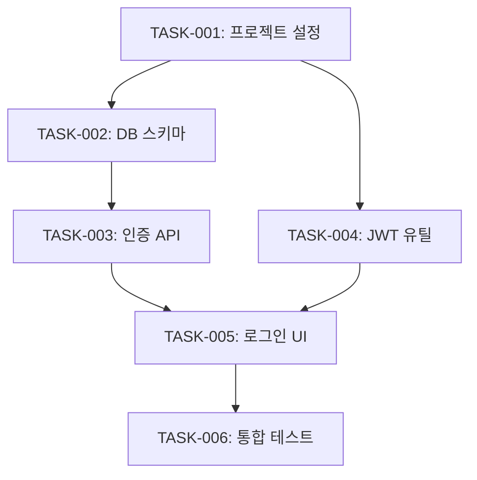

## User Input

```text
$ARGUMENTS
```

You **MUST** consider the user input before proceeding (if not empty).


## When to Use

- 기능 구현 직전
- plan 완료 후 자동 전환 시
- "태스크", "작업 분리", "TODO" 키워드 시

## Prerequisites

- `docs/.checkpoints/{feature}/specify.md` 존재 (status: ready)
- `docs/.checkpoints/{feature}/plan.md` 존재 (status: ready)
- 없으면 이전 단계 먼저 실행 안내

## Process

```mermaid
flowchart TD
    A[Specify/Plan 체크포인트 로드] --> B[Task 체크포인트 생성]
    B --> C[태스크 초안 작성]
    C --> D[Clarify 호출]
    D --> E{모호함 해소?}
    E -->|No| D
    E -->|Yes| F[태스크 확정]
    F --> G[체크포인트 Ready]
    G --> H[완료 메시지]
    H --> I{다음 단계?}
    I -->|yes| J[/implement 실행]
    I -->|no| K[대기]
```

## Step 1: Load Previous Checkpoints

```
docs/.checkpoints/{feature}/specify.md
- Functional Requirements
- Acceptance Criteria

docs/.checkpoints/{feature}/plan.md
- Architecture Overview
- Component Design
- File Structure
- Technical Decisions
```
**Load design documents**: Read from FEATURE_DIR:
   - **Required**: plan.md (tech stack, libraries, structure), spec.md (user stories with priorities)
**Execute task generation workflow**:
  - Load plan.md and extract tech stack, libraries, project structure
  - Load spec.md and extract specs
  - Generate tasks
  - Generate dependency graph

## Step 2: Create Task Checkpoint

`docs/.checkpoints/{feature}/task.md` 생성

`.cursor/templates/checkpoint-task.md` 파일을 활용하여 내용을 채웁니다. **반드시 템플릿 파일에서 시작해야 합니다.**


## Step 4: Run Clarify

`clarify` skill을 호출하여 태스크 관련 모호함을 해소합니다.

이전 단계에서 모호함이 해결되었어도 최대한 재검토하여 모호함을 지워야 합니다.

**Clarify 포커스 카테고리** (task 단계):
- Interaction & UX
- Non-Functional
- Integration
- Edge Cases (필수)
- Completion Signals (필수)
- Misc

```text
/clarify docs/.checkpoints/{feature}/task.md
```

## Step 5: Finalize Tasks

clarify 완료 후 태스크를 확정합니다.

### Implementation Order

```markdown
### Implementation Order


```

### Task Details

```markdown
### Task Details

#### TASK-001: 프로젝트 초기 설정
- **Description**: 프로젝트 구조 생성, 의존성 설치
- **Files**:
  - package.json
  - tsconfig.json
  - src/index.ts
- **Acceptance**:
  - [ ] npm install 성공
  - [ ] TypeScript 컴파일 성공
- **Test**: 빌드 성공 확인

#### TASK-002: User 엔티티 및 DB 스키마
- **Description**: User 모델 정의, 마이그레이션
- **Files**:
  - src/models/User.ts
  - migrations/001_create_users.sql
- **Acceptance**:
  - [ ] User 테이블 생성
  - [ ] CRUD 동작 확인
- **Test**: 단위 테스트

...
```

## Step 6: Completion Message

**사용자에게 A(yes), B(no), C(other...)로 질문을 출력합니다.**

```markdown
## Task 완료

**체크포인트**: `docs/.checkpoints/auth-login-task.md`
**상태**: Ready

### Task Summary
| Task ID | Description | Effort |
|---------|-------------|--------|
| TASK-001 | 프로젝트 초기 설정 | S |
| TASK-002 | User 엔티티 및 DB 스키마 | M |
| TASK-003 | 인증 API 엔드포인트 | M |
| TASK-004 | JWT 토큰 유틸리티 | S |
| TASK-005 | 로그인 컴포넌트 | M |
| TASK-006 | 통합 테스트 | M |

**Total**: 6 tasks, Est. 8-12 hours

---

**다음 단계**: /implement - 구현 시작

| Option | Action |
|--------|--------|
| yes | /implement 바로 실행 |
| no | 대기 (나중에 수동 실행) |

Reply: yes, no, or another command
```

## Step 7: Next Stage Transition

사용자 응답에 따라:
- `yes` → /implement skill 자동 실행
- `no` → 대기
- 다른 명령 → 해당 명령 실행

## Output

- 생성: `docs/.checkpoints/{feature}/task.md`
- 상태: Ready
- 다음 단계: /implement 추천

## Error Handling

- 이전 체크포인트 없음 → 해당 단계 먼저 실행 안내
- 태스크 의존성 순환 → 경고 후 재구성 요청
- 태스크 너무 큼 → 분할 제안

## Integration

```
/specify (완료) 
    ↓
/plan (완료)
    ↓
/task (현재)
    ├── specify, plan 체크포인트 참조
    ├── clarify 호출
    └── task 체크포인트 생성
    ↓
/implement (다음)
```
