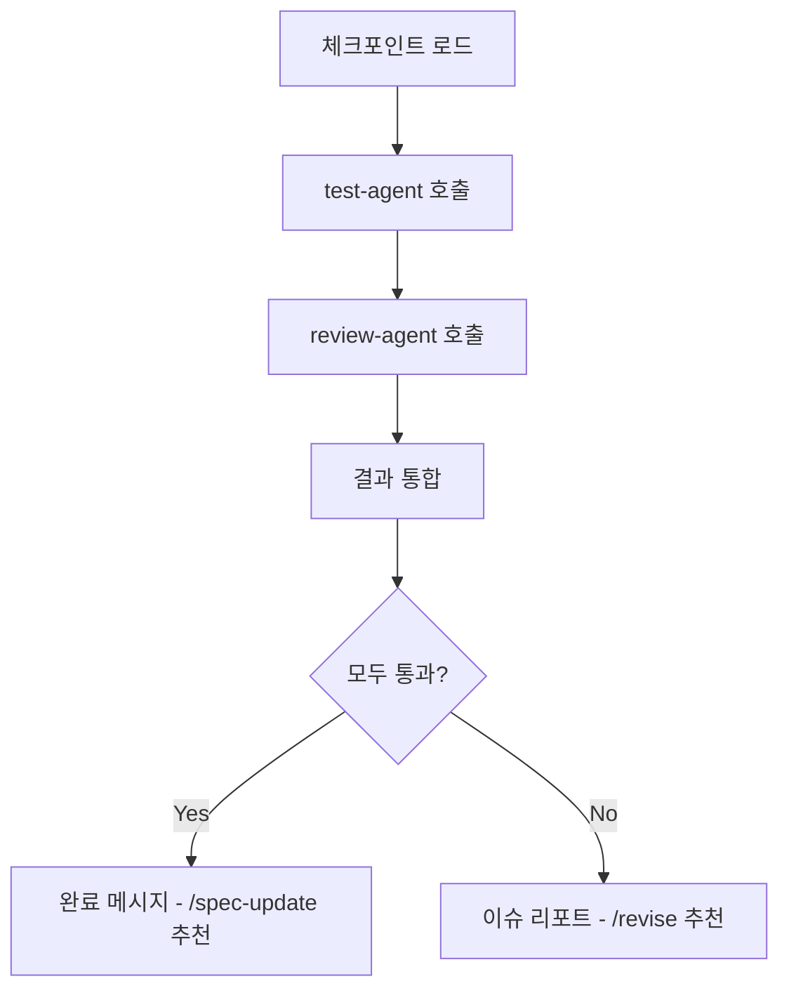

# Verify Skill

구현된 코드를 테스트하고 리뷰하여 품질을 검증합니다.

## When to Use

- `/verify` 명령 시
- implement 완료 후 자동 전환 시
- revise 완료 후 재검증 시
- "검증", "테스트", "리뷰" 키워드 시

## Prerequisites

- 구현된 코드 (커밋 완료)
- 모든 체크포인트 접근 가능

## Process



## Step 1: Load Context

체크포인트에서 검증 기준을 로드합니다.

```
docs/.checkpoints/{feature}-specify.md
- Acceptance Criteria

docs/.checkpoints/{feature}-task.md
- Task Details (각 태스크의 Test Strategy)

docs/.checkpoints/{feature}-plan.md
- Technical Decisions
- Non-Functional Requirements
```

## Step 2: Call test-agent

테스트 에이전트를 호출하여 테스트를 실행합니다.

```markdown
Task(
  subagent_type="generalPurpose",
  model="fast",
  readonly=true,
  prompt="""
  test-agent로 테스트를 실행하세요.
  
  검증 항목:
  1. 단위 테스트 실행
  2. 통합 테스트 실행 (있는 경우)
  3. 커버리지 확인
  
  Acceptance Criteria:
  {체크포인트에서 로드한 기준}
  
  결과를 다음 형식으로 반환:
  - 통과/실패
  - 실패한 테스트 목록
  - 커버리지 수치
  """
)
```

### test-agent 출력

```markdown
## Test Results

**Status**: PASS / FAIL

### Summary
- Total: 25 tests
- Passed: 23
- Failed: 2
- Coverage: 78%

### Failed Tests
1. `auth.test.ts:45` - login should reject invalid credentials
   - Expected: 401
   - Received: 500

2. `user.test.ts:30` - createUser should validate email
   - Expected: ValidationError
   - Received: undefined

### Coverage Report
| File | Statements | Branches | Functions |
|------|-----------|----------|-----------|
| auth.ts | 85% | 70% | 90% |
| user.ts | 75% | 60% | 80% |
```

## Step 3: Call review-agent

리뷰 에이전트를 호출하여 코드 리뷰를 수행합니다.

```markdown
Task(
  subagent_type="generalPurpose",
  model="inherit",
  readonly=true,
  prompt="""
  review-agent로 코드 리뷰를 수행하세요.
  
  체크포인트 참조:
  - Technical Decisions: {plan 체크포인트}
  - Requirements: {specify 체크포인트}
  
  검토 항목:
  1. 코드 품질 (가독성, 유지보수성)
  2. 보안 이슈
  3. 성능 문제
  4. 명세 준수 여부
  
  결과를 Critical/Warning/Info로 분류하여 반환.
  """
)
```

### review-agent 출력

```markdown
## Code Review Results

**Status**: PASS / FAIL (Critical 이슈 있으면 FAIL)

### Issues Found

#### Critical (0)
(없음)

#### Warning (2)
1. `src/auth/login.ts:25`
   - Issue: SQL injection 가능성
   - Suggestion: parameterized query 사용

2. `src/utils/jwt.ts:10`
   - Issue: 하드코딩된 secret
   - Suggestion: 환경변수 사용

#### Info (3)
1. `src/auth/login.ts:40` - 매직 넘버 사용, 상수로 추출 권장
2. `src/user/model.ts:15` - 타입 추론 가능, 명시적 타입 불필요
3. `src/index.ts:5` - 미사용 import 제거 필요
```

## Step 4: Integrate Results

두 에이전트 결과를 통합합니다.

### 통과 기준
- test-agent: 모든 테스트 통과 + 커버리지 목표 달성
- review-agent: Critical 이슈 없음

## Step 5: Verification Report

### 성공 시

```markdown
## Verify 완료 ✓

**Feature**: auth-login
**Status**: PASS

### Test Results
- Tests: 25/25 passed
- Coverage: 78% (target: 70%)

### Review Results
- Critical: 0
- Warning: 2
- Info: 3

### Warnings (권장 수정)
1. SQL injection 가능성 → parameterized query 권장
2. 하드코딩된 secret → 환경변수 권장

---

**다음 단계**: /spec-update - 명세 동기화

| Option | Action |
|--------|--------|
| yes | /spec-update 바로 실행 |
| no | 대기 (나중에 수동 실행) |
| fix | Warning 수정 후 재검증 |

Reply: yes, no, fix, or another command
```

### 실패 시

```markdown
## Verify 실패 ✗

**Feature**: auth-login
**Status**: FAIL

### Test Results
- Tests: 23/25 passed (2 failed)
- Coverage: 78%

### Failed Tests
1. `auth.test.ts:45` - login should reject invalid credentials
2. `user.test.ts:30` - createUser should validate email

### Review Results
- Critical: 1
- Warning: 2

### Critical Issues (필수 수정)
1. SQL injection 취약점 발견

---

**다음 단계**: /revise - 이슈 수정

| Option | Action |
|--------|--------|
| yes | /revise 바로 실행 |
| no | 대기 (나중에 수동 실행) |

Reply: yes, no, or another command
```

## Step 6: Next Stage Transition

검증 결과에 따라:
- **PASS + yes** → /spec-update 자동 실행
- **PASS + fix** → Warning 수정 후 /verify 재실행
- **FAIL + yes** → /revise 자동 실행
- **no** → 대기

## Output

- 검증 리포트 (테스트 + 리뷰)
- 다음 단계 추천:
  - 성공 → /spec-update
  - 실패 → /revise

## Error Handling

- 테스트 환경 없음 → 테스트 설정 안내
- 에이전트 호출 실패 → 재시도 옵션
- 타임아웃 → 부분 결과 표시 + 수동 검증 안내

## Integration

```
/implement (완료)
    ↓
/verify (현재)
    ├── test-agent 호출
    ├── review-agent 호출
    └── 결과 통합
    ↓
  ┌─────┴─────┐
  ↓           ↓
/spec-update  /revise
(PASS)        (FAIL)
```
