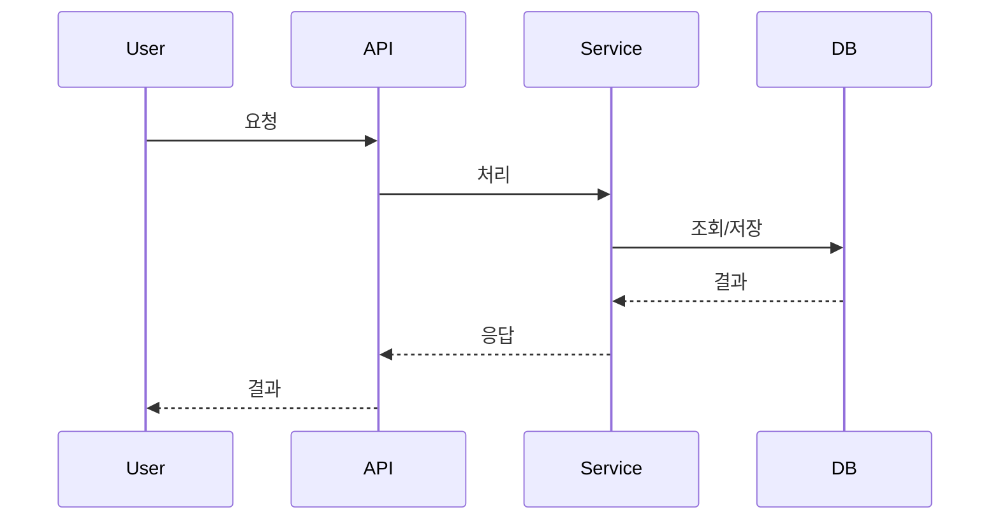

# {{feature}} - Plan Checkpoint

## Metadata
- feature: {{feature}}
- stage: plan
- status: in_progress
- created: {{date}}
- depends_on: 
  - docs/.checkpoints/{{feature}}/specify.md

## Clarifications
### Session {{date}}
<!-- Q&A from clarify process will be added here -->

## Coverage Map
| Category | Status | Notes |
|----------|--------|-------|
| Domain & Data Model | Missing | |
| Interaction & UX | Missing | |
| Edge Cases | Missing | |
| Constraints | Missing | |

---

## Summary

[Extract from feature spec: primary requirement + technical approach from research]

## Content

### Architecture Overview
<!-- 전체 아키텍처 개요 -->

### Technology Stack
<!--
  ACTION REQUIRED: Replace the content in this section with the technical details
  for the project. The structure here is presented in advisory capacity to guide
  the iteration process.
-->

**Language/Version**: [e.g., Python 3.11, Swift 5.9, Rust 1.75 or NEEDS CLARIFICATION]  
**Primary Dependencies**: [e.g., FastAPI, UIKit, LLVM or NEEDS CLARIFICATION]  
**Storage**: [if applicable, e.g., PostgreSQL, CoreData, files or N/A]  
**Testing**: [e.g., pytest, XCTest, cargo test or NEEDS CLARIFICATION]  
**Target Platform**: [e.g., Linux server, iOS 15+, WASM or NEEDS CLARIFICATION]
**Project Type**: [single/web/mobile - determines source structure]  
**Performance Goals**: [domain-specific, e.g., 1000 req/s, 10k lines/sec, 60 fps or NEEDS CLARIFICATION]  
**Constraints**: [domain-specific, e.g., <200ms p95, <100MB memory, offline-capable or NEEDS CLARIFICATION]  
**Scale/Scope**: [domain-specific, e.g., 10k users, 1M LOC, 50 screens or NEEDS CLARIFICATION]

### Component Design
<!-- 주요 컴포넌트 설계 -->

### Data Model
<!-- 데이터 모델 설계 -->

### Data Flow

<!--
  ACTION REQUIRED: 주요 사용자 시나리오의 데이터 흐름을 시각화합니다.
-->




### File Structure
<!--
  ACTION REQUIRED: Replace the placeholder tree below with the concrete layout
  for this feature. Delete unused options and expand the chosen structure with
  real paths (e.g., apps/admin, packages/something). The delivered plan must
  not include Option labels.
-->

```text
# [REMOVE IF UNUSED] Option 1: Single project (DEFAULT)
src/
├── models/
├── services/
├── cli/
└── lib/

tests/
├── contract/
├── integration/
└── unit/

# [REMOVE IF UNUSED] Option 2: Web application (when "frontend" + "backend" detected)
backend/
├── src/
│   ├── models/
│   ├── services/
│   └── api/
└── tests/

frontend/
├── src/
│   ├── components/
│   ├── pages/
│   └── services/
└── tests/

# [REMOVE IF UNUSED] Option 3: Mobile + API (when "iOS/Android" detected)
api/
└── [same as backend above]

ios/ or android/
└── [platform-specific structure: feature modules, UI flows, platform tests]
```

**Structure Decision**: [Document the selected structure and reference the real
directories captured above]

### Integration Points
<!-- 외부 시스템 연동 지점 -->


### Technical Decisions
<!-- 주요 기술적 결정 사항 -->
| Decision | Options Considered | Selected | Reason |
|----------|-------------------|----------|--------|
| | | | |

### ## Complexity Tracking

> **Fill ONLY if Constitution Check has violations that must be justified**

| Violation | Why Needed | Simpler Alternative Rejected Because |
|-----------|------------|-------------------------------------|
| [e.g., 4th project] | [current need] | [why 3 projects insufficient] |
| [e.g., Repository pattern] | [specific problem] | [why direct DB access insufficient] |


## Open Questions
- [ ] 

## Next Step
→ /task
