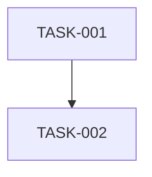

# {{feature}} - Task Checkpoint

## Metadata
- feature: {{feature}}
- stage: task
- status: in_progress
- created: {{date}}
- depends_on: 
  - docs/.checkpoints/{{feature}}/specify.md
  - docs/.checkpoints/{{feature}}/plan.md

## Clarifications
### Session {{date}}
<!-- Q&A from clarify process will be added here -->

## Coverage Map
| Category | Status | Notes |
|----------|--------|-------|
| Functional Scope | Clear | (from specify) |
| Domain & Data Model | Clear | (from plan) |
| Interaction & UX | Missing | |
| Non-Functional | Missing | |
| Integration | Missing | |
| Edge Cases | Missing | |
| Constraints | Clear | (from plan) |
| Terminology | Missing | |
| Completion Signals | Missing | |
| Misc | Missing | |

## Content

### Task List
<!-- 구현 태스크 목록 -->

| Task ID | Description | Dependencies | Estimated Effort |
|---------|-------------|--------------|------------------|
| TASK-001 | | | |
| TASK-002 | | | |

### Implementation Order
<!-- 구현 순서 및 의존성 -->

### Task Details

#### TASK-001: {{title}}
- **Description**: 
- **Files to create/modify**:
- **Acceptance criteria**:
- **Test strategy**:

#### TASK-002: {{title}}
- **Description**: 
- **Files to create/modify**:
- **Acceptance criteria**:
- **Test strategy**:

### Risk Assessment
<!-- 위험 요소 및 대응 방안 -->

| Risk | Impact | Mitigation |
|------|--------|------------|
| | | |

## Open Questions
- [ ] 

## Next Step
→ /implement
